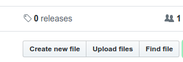

# Mau kontribusi? Ayo daftar dulu disini

Ikuti panduan berikut ini:

* Join komunitas Surabaya.py di http://t.me/surabayadotpy
* Fork repository ini (pojok kanan atas)

* Buat folder baru dengan nama usernamemu dan file username.md, lalu tambahkan sesuai contoh

* Pull request

Selesai! Selamat berkontribusi.
